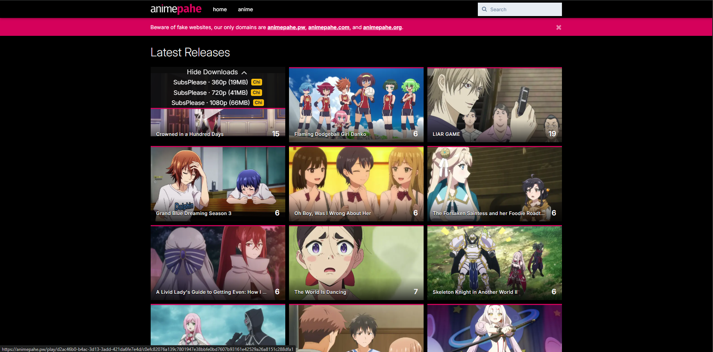
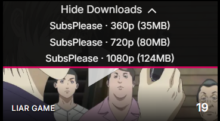
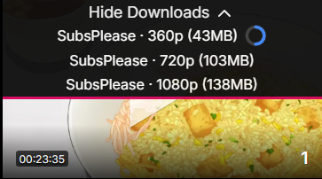
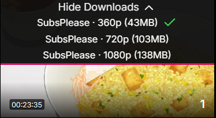
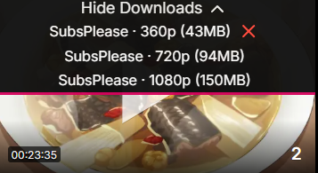

# AnimePahe Quick Downloader

AnimePahe Quick Downloader is a lightweight browser extension that helps you download episodes from AnimePahe faster and more conveniently.

## Features

- Users can view download options available for their favourite Anime and download it seamlessly 
- Detects episode links and download URLs
- Provides fast access to browser download flow
- Designed for a simple and minimal workflow

## Extension UI Showcase

<table>
  <tr>
    <td align="center" colspan="3">
       
      <b>Homepage</b>
    </td>
  </tr>

  <tr>
    <td align="center">
       
      <b>On Hover</b>
    </td>
    <td align="center">
       
      <b>Dropdown</b>
    </td>
    <td align="center">
       
      <b>Progress Bar</b>
    </td>
  </tr>

  <tr>
    <td align="center">
       
      <b>Download Complete</b>
    </td>
    <td align="center">
       
      <b>Download Failed</b>
    </td>
  </tr>
</table>

## Installation

1. Open your browser's extension management page.
2. Enable Developer Mode.
3. Load the unpacked extension folder.
4. Make sure the extension files are present in the project root.

## Development

This extension is built using standard web extension files such as:

- `manifest.json`
- `popup.html`
- `popup.js`
- `content.js`
- `background.js`

## Usage

1. Navigate to an AnimePahe episode page.
2. Open the extension popup.
3. Use the quick download controls to begin the download process.

## Notes

This project is intended as a browser extension utility for AnimePahe-related downloads. Please respect site terms of service and copyright laws when downloading media.
